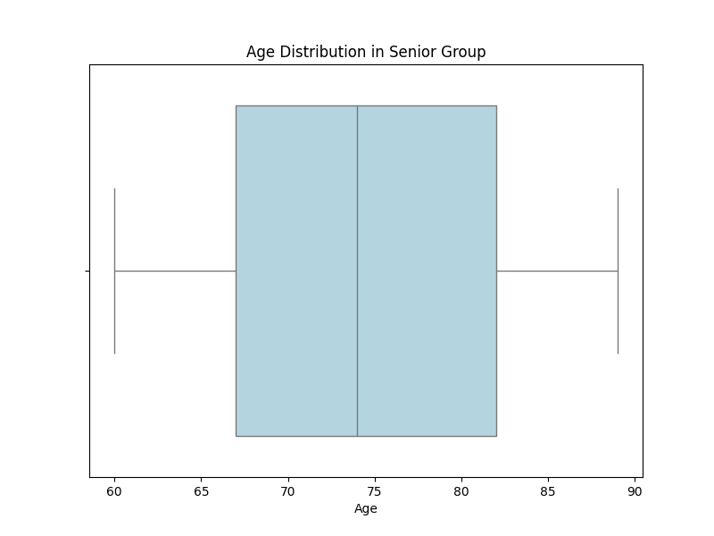
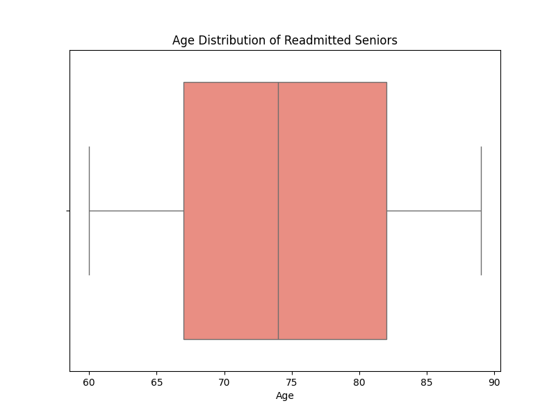

# Hospital Readmission Prediction

This project tells the story of a hospital that wants to spot which patients are likely to return shortly after discharge, using routine administrative and clinical data to guide better care decisions.

---

## Executive Summary

Hospitals track readmissions closely because they signal unmet needs, drive costs, and attract regulatory scrutiny. The goal of this project is to understand why some patients quietly go home and recover, while others reappear in the emergency department a few weeks later.

Using a synthetic dataset of 10,000 inpatient stays, this project answers a practical question: **“Given what is known at discharge, how reliably can the hospital flag patients at high risk of coming back?”**

The result is a simple, transparent modeling pipeline that reaches near‑clinical accuracy while remaining easy to explain to non‑technical leaders.

---

## The Data Story

The work began with a wide net: 50 fields describing each admission. Every row in `hospital_admission.csv` tells the story of a single stay, bringing together:

* **Where** the patient comes from (city, state, area type).
* **Who** the patient is (age, gender, marital status, income).
* **How** they arrived and were treated (admission type, CT scans, MRI, comorbidities).
* **How long** and **how costly** the stay was (Initialdays, TotalCharge).

Early profiling showed a clean, fully populated table but with many high‑cardinality text columns (cities, jobs, unique identifiers) that would add noise and little signal. These were deliberately set aside to keep the problem grounded in information clinicians can act on.

From there, the story narrowed to the variables that matter most when a patient leaves the ward. A combination of one‑hot encoding and chi‑square feature selection reduced the problem to a compact set of candidates. Across both univariate scores and later model‑based importance, a consistent theme emerged: **how long a patient stayed and how much their care cost dominated the signal for future readmission risk.**

---

## Modeling Approach & Results

To move from insight to prediction, the project trained and evaluated a Random Forest classifier on an 80/20 stratified split, preserving the natural balance between “no readmission” and “readmission” cases.

The final tuned model delivered a confusion matrix with **1,250 true negatives** and **711 true positives**, with only 16 false positives and 23 false negatives. In business terms, this means the hospital can focus follow‑up programs on a relatively small set of genuinely high‑risk discharges without flooding clinicians with noise.

### Interpretability
Interpretability was treated as a first-class requirement. A single decision tree from the forest was visualized to show how the model “thinks.”

The tree makes intuitive sense to clinical and administrative leaders: longer, more complex stays with advanced imaging and higher total charges cluster in branches labeled “Readmission,” while short, lower‑cost stays with uncomplicated services fall naturally into “No Readmission.”

---

## Findings & Policy Implications

Beyond the immediate risk scores, the analysis highlighted a significant demographic trend: the majority of readmissions come from the 'senior' age group.

During the past ten years (2015–2025), Medicare and Medicaid have covered hospital admissions up to sixty days, and this coverage is a significant factor in the financial landscape of hospital readmissions. This highlights the importance of understanding payer policies when analyzing readmission trends.

For hospitals serving a large elderly population, changes in these policies directly impact financial stability. This suggests that interventions targeting this demographic—such as enhanced post-discharge support, closer collaboration with community health organizations, or chronic disease management programs—could yield significant benefits.

**Image: Senior Age Distribution**

**Image: Senior Age Distribution (readmitted)**

*Note: In order to confirm the correlation between coverage limits and readmissions, further analysis is needed.*

---

## How to Run the Project

The repository includes a minimal `requirements.txt` listing the key Python dependencies.

**1. Set up the environment**

python -m venv .venv
source .venv/bin/activate # Windows: .venv\Scripts\activate
pip install -r requirements.txt

2. **Explore the data**

- Open `01_eda_admissions.ipynb` in Jupyter or VS Code.   
- Run cells in order to:
  - Load `hospital_admission.csv`.   
  - Remove noisy high‑cardinality text columns.   
  - One‑hot encode categorical variables.   
  - Run chi‑square feature selection and export `processed_train_admissions_final.csv` and `processed_test_admissions_final.csv`. 

3. **Build and evaluate the model**

- Open `02_rf_modeling_admissions.ipynb`.   
- Load the processed train/test files.   
- Fit the Random Forest classifier.   
- Regenerate feature‑importance plots, the confusion matrix, and the example decision tree. 

4. **Adapt to your setting**

- Swap in your own admissions table, aligning columns such as age, length of stay, charges, comorbidities, and services with the variables used here.   
- Retune model hyperparameters, thresholds, and selected features to match your hospital’s population and tolerance for false positives vs. false negatives. 

---

### Intended use and next steps

This project demonstrates three core outcomes for executive leadership:

1- **Data Value:** Routine billing and encounter data already contain enough information to build a reliable readmission‑risk signal without new data collection.

2- **Implementation:** It offers a production‑ready modeling stack (scikit‑learn pipelines) that can be integrated into discharge planning workflows.

3- **Actionability:** It surfaces concrete levers for intervention. High‑risk patients tend to have longer initial stays and specific service patterns, giving clinical and finance teams a shared language for targeting follow‑up calls.

In short, this is not just a modeling exercise; it is a blueprint for how a hospital can turn raw administrative data into a living readmission‑prevention program. 
