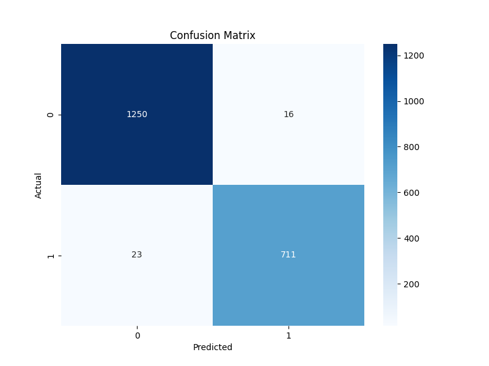

# Hospital Readmission Prediction Project
This project analyzes 10,000 hospital patient records to predict readmission risk, enabling cost savings and better patient care from healthcare providers. I used the Random Forest Algorithm to classify the data and identify the most important features.

## Patient Journey Story
This analysis traces 10,000 cases from demographics and Vitamin D levels to charges and services like CT scans, revealing drivers like longer stays and high bills as readmission red flags. The purpose of this analysis is to deliver a model that can identify if the next patient will be readmitted. 

## Dataset Breakdown
Core data spans 50 columns across patient profiles (age, income, gender), health risks (diabetes, asthma, high blood pressure), admission details (type, complications), and billing (TotalCharge, Items 1-8).​

10K rows total; 80/20 train/test split after EDA cleaning.

Target: **ReAdmis** (Yes/No) for prediction.

| File | Size | Role |
|---|---|---|
| `hospital_admission.csv` | 3.5M chars | Raw 10K records |
| `train_admissions.csv` | 1.4M chars | Training set |
| `test_admissions.csv` | 361K chars | Test set |

## EDA Workflow
`01_eda_admissions.ipynb` 
* loads raw CSV, drops high-cardinality fields (City, Job), one-hot encodes to 37 features.​
* Chi-squared ranks top predictors: TotalCharge (6.37e6 score), Initialdays, Income; filters to 7 via score>0.5, p<0.05 thresholds.​
* Exports stratified CSVs ready for modeling.

## Modeling Pipeline
`02_rf_modeling_admissions.ipynb` 
* trains Random Forest Classifier on the selected features.​
* 80/20 stratified split; evaluates accuracy, precision, recall on ReAdmisYes.
* Key insight: High charges and long initial stays are the dominant predictors. Feature importance analysis shows `Initial_days` contributes ~58.5% and `TotalCharge` contributes ~37.2% to the model.

* The model achieved a Precision of 0.9780, Recall of 0.9687, F1-Score of 0.9733, and AUC-ROC of 0.9986 on the test set. this means that: 
    * **Precision:** Of all patients predicted to be readmitted, 97.80% were actually readmitted.
    * **Recall:** The model correctly identified 96.87% of all actual readmissions.
    * **F1-Score:** The F1-Score of 0.9733 indicates a strong balance between precision and recall.
    * **AUC-ROC:** An AUC-ROC of 0.9986 suggests an excellent ability to distinguish between readmitted and non-readmitted patients.

We can also see the correct classification with the confusion matrix below.

